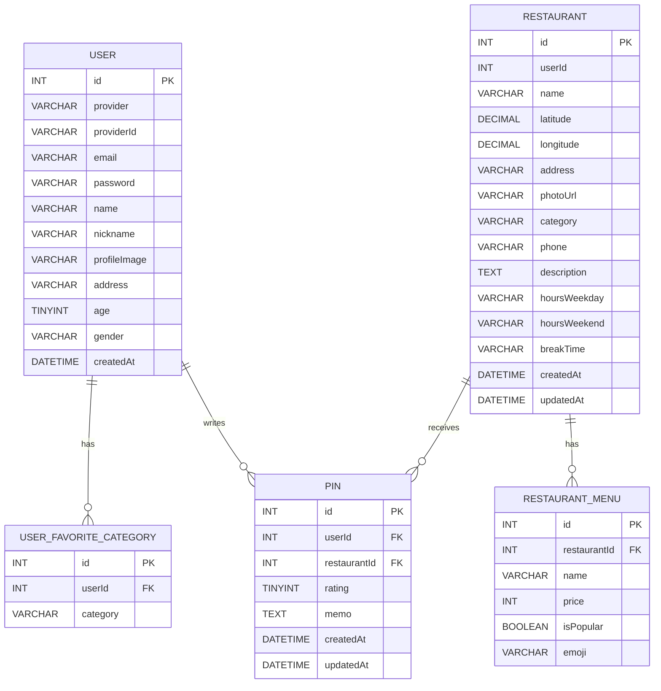

# 🍽️ FoodPin - 맛집 핀 지도 앱

가본 식당을 지도에 핀으로 기록하고, 별점과 메모를 남기는 모바일 퍼스트 맛집 아카이빙 서비스입니다.

## 📋 목차

<table>
<tr>
<td><a href="#프로젝트-소개">📌 프로젝트 소개</a></td>
<td><a href="#핵심-기능">✨ 핵심 기능</a></td>
<td><a href="#기술-스택">🛠 기술 스택</a></td>
<td><a href="#서비스-흐름">🧭 서비스 흐름</a></td>
</tr>
<tr>
<td><a href="#서비스-화면">🖼 서비스 화면</a></td>
<td><a href="#api-명세">📡 API 명세</a></td>
<td><a href="#시스템-아키텍처">🏗 시스템 아키텍처</a></td>
<td><a href="#프로젝트-구조">🗂 프로젝트 구조</a></td>
</tr>
<tr>
<td><a href="#db-설계">🧩 DB 설계</a></td>
<td><a href="#구현-포인트">💡 구현 포인트</a></td>
<td><a href="#알려진-한계">⚠ 알려진 한계</a></td>
<td><a href="#로컬-실행-방법">🚀 로컬 실행 방법</a></td>
</tr>
<tr>
<td><a href="#환경변수">🔐 환경변수</a></td>
<td><a href="#개발-현황">📈 개발 현황</a></td>
<td><a href="#문서-지도">📚 문서 지도</a></td>
<td><a href="#작성자">👤 작성자</a></td>
</tr>
</table>

---

<a id="프로젝트-소개"></a>

## 📌 프로젝트 소개

- **프로젝트명**. FoodPin.
- **한 줄 소개**. 내 맛집 기록을 지도 기반으로 관리하는 웹 앱.
- **개발 목적**. NestJS + React 기반 풀스택 포트폴리오 프로젝트.
- **핵심 가치**. 위치 기반 탐색, 개인화된 핀 기록, 간결한 인증 흐름.

---

<a id="핵심-기능"></a>

## ✨ 핵심 기능

1. **카카오맵 연동**. 지도에서 식당 핀을 확인하고 위치 중심으로 탐색할 수 있습니다.
2. **식당 CRUD**. 식당 기본 정보, 메뉴, 영업시간, 사진을 등록·수정·삭제할 수 있습니다.
3. **핀(별점·메모) CRUD**. 유저는 식당마다 핀 1개를 남기고 수정·삭제할 수 있습니다.
4. **소셜 로그인**. 카카오·네이버 OAuth2와 일반 이메일 로그인을 함께 지원합니다.
5. **알림**. 근처 신규 식당과 내가 핀한 식당의 신규 리뷰 알림을 제공합니다.
6. **프로필 관리**. 닉네임·주소·선호 카테고리·프로필 사진을 변경할 수 있습니다.
7. **이미지 업로드**. 업로드 파일을 `/uploads` 정적 경로로 서빙합니다.

---

<a id="기술-스택"></a>

## 🛠 기술 스택

### Backend
<p>
  
  
  
  
  
  
  
  
</p>

### Frontend
<p>
  
  
  
  
  
  
</p>

### Database & Build & Deploy
<p>
  
  
  
  
</p>

### Collaboration
<p>
  
</p>

---

<a id="서비스-흐름"></a>

## 🧭 서비스 흐름

### 1) 인증 진입

- 온보딩 이후 일반 로그인 또는 소셜 로그인으로 진입합니다.
- 소셜 로그인 사용자는 프로필 필수값(name/address/age/gender) 미완성 시 `/complete-profile`에서 완료 후 홈으로 이동합니다.

### 2) 식당 탐색 및 기록

- 홈과 지도 탭에서 식당을 탐색합니다.
- 상세 화면에서 메뉴·정보·리뷰를 확인하고 핀(별점·메모)을 남깁니다.

### 3) 개인화 기능

- 마이페이지에서 찜한 식당과 프로필을 관리합니다.
- 알림 페이지에서 위치 기반 신규 식당 및 리뷰 알림을 확인합니다.

---

<a id="서비스-화면"></a>

## 🖼 서비스 화면

> 현재 저장소에 포함된 대표 이미지는 아래 1장입니다.


---

<a id="api-명세"></a>

## 📡 API 명세

- 상세 명세 문서. [`docs/api.md`](docs/api.md)
- Base URL(개발). `http://localhost:3000`

대표 엔드포인트.
- `POST /auth/register`
- `POST /auth/login`
- `GET/POST/PATCH/DELETE /restaurants`
- `GET/POST/PATCH/DELETE /pins`
- `GET /notifications`
- `POST /upload/image`
- `GET/PATCH /users/me`

---

<a id="시스템-아키텍처"></a>

## 🏗 시스템 아키텍처

```text
Browser (React + Vite, :5173)
        ↓ HTTP(fetch, JWT)
NestJS API (:3000)
  Controller → Service → TypeORM Repository
        ↓
      MySQL

정적 파일: /uploads/*
```

프론트 라우팅은 탭 페이지 keep-alive와 세부 오버레이 페이지를 혼합한 구조를 사용합니다.

---

<a id="프로젝트-구조"></a>

## 🗂 프로젝트 구조

```text
FoodPin/
├── backend/
│   └── src/
│       ├── auth/
│       ├── notifications/
│       ├── pins/
│       ├── restaurants/
│       ├── upload/
│       └── users/
├── frontend/
│   └── src/
│       ├── api/
│       ├── components/
│       ├── pages/
│       │   ├── auth/
│       │   ├── my/
│       │   └── restaurant/
│       └── utils/
├── docs/
├── features/
├── db.sql
└── CLAUDE.md
```

---

<a id="db-설계"></a>

## 🧩 DB 설계



핵심 제약.
- `PIN(userId, restaurantId)` 복합 UNIQUE 제약으로 유저당 식당 핀 1개를 보장합니다.
- 소셜 로그인 유저 지원을 위해 `USER.email`, `USER.password`, `USER.provider`, `USER.providerId`는 nullable로 운용합니다.

---

<a id="구현-포인트"></a>

## 💡 구현 포인트

### 1) OAuth2 + JWT 통합 인증 흐름
- 일반 로그인과 소셜 로그인을 동일 JWT 체계로 통합했습니다.
- 소셜 콜백은 URL fragment 방식으로 토큰을 전달해 서버 로그 노출 위험을 줄였습니다.

### 2) 소셜 로그인 프로필 완성 강제
- 일반 가입과 데이터 일관성을 맞추기 위해 소셜 신규 유저도 필수 프로필 입력을 강제합니다.

### 3) 지도 페이지 keep-alive 설계
- 카카오맵 초기화 깨짐 문제를 피하기 위해 최초 마운트 이후에는 `display` 전환 중심으로 관리합니다.

### 4) 알림 계산형 아키텍처
- 별도 큐 없이 조회 시점 계산 방식으로 근처 신규 식당과 신규 리뷰 알림을 조합합니다.

### 5) 업로드 단순화
- 이미지 업로드 API를 별도 모듈로 분리하고, 저장은 로컬 디스크·조회는 정적 서빙으로 구성했습니다.

---

<a id="알려진-한계"></a>

## ⚠ 알려진 한계

1. 토큰 저장은 `localStorage` 기반이라 XSS 대응 관점에서 개선 여지가 있습니다.
2. `restaurant.userId = null` 레코드는 현재 정책상 인증 유저가 수정 가능한 상태입니다.
3. 알림은 실시간 푸시가 아닌 조회 기반 계산 방식입니다.

---

<a id="로컬-실행-방법"></a>

## 🚀 로컬 실행 방법

### 1) 요구 사항
- Node.js 20+
- npm 10+
- MySQL 8+

### 2) 의존성 설치

```bash
npm install
```

### 3) 개발 서버 실행

```bash
npm run dev:backend
npm run dev:frontend
```

- Backend. `http://localhost:3000`
- Frontend. `http://localhost:5173`

### 4) 빌드

```bash
npm run build:backend
npm run build:frontend
```

---

<a id="환경변수"></a>

## 🔐 환경변수

### backend/.env

```env
PORT=3000
DB_HOST=localhost
DB_PORT=3306
DB_USERNAME=root
DB_PASSWORD=
DB_DATABASE=foodpin
JWT_SECRET=
FRONTEND_URL=http://localhost:5173

KAKAO_CLIENT_ID=
KAKAO_CLIENT_SECRET=
KAKAO_CALLBACK_URL=http://localhost:3000/auth/kakao/callback

NAVER_CLIENT_ID=
NAVER_CLIENT_SECRET=
NAVER_CALLBACK_URL=http://localhost:3000/auth/naver/callback
```

### frontend/.env

```env
VITE_API_URL=http://localhost:3000
VITE_KAKAO_MAP_KEY=
```

---

<a id="개발-현황"></a>

## 📈 개발 현황

| 단계 | 내용 | 상태 |
| --- | --- | --- |
| 1 | 모노레포 세팅 (NestJS + Vite React TS) | ✅ 완료 |
| 2 | 카카오맵 연동 | ✅ 완료 |
| 3 | 식당 CRUD API | ✅ 완료 |
| 4 | 지도 클릭 기반 식당 등록 UI | ✅ 완료 |
| 5 | 핀 CRUD + 내 핀 조회 | ✅ 완료 |
| 6 | 카카오/네이버 OAuth2 + 일반 로그인·JWT | ✅ 완료 |
| 7 | 식당 상세(메뉴·리뷰·부가정보) | ✅ 완료 |
| 8 | 이미지 업로드 | ✅ 완료 |
| 9 | 알림 기능 | ✅ 완료 |
| 10 | Capacitor(iOS/Android) | 🔲 예정 |
| 11 | 반응형 UI 마감 | 🔲 예정 |
| 12 | AWS Lightsail 배포 | 🔲 예정 |

---

<a id="문서-지도"></a>

## 📚 문서 지도

- 프로젝트 개요. [`docs/project-overview.md`](docs/project-overview.md)
- 시스템 구조. [`docs/architecture.md`](docs/architecture.md)
- ERD. [`docs/erd.md`](docs/erd.md)
- API 명세. [`docs/api.md`](docs/api.md)
- 보안. [`docs/security.md`](docs/security.md)
- 코딩 스타일. [`docs/coding-style.md`](docs/coding-style.md)
- 기능 문서. [`features/`](features)

---

<a id="작성자"></a>

## 👤 작성자

- @KimTaehyeok01
